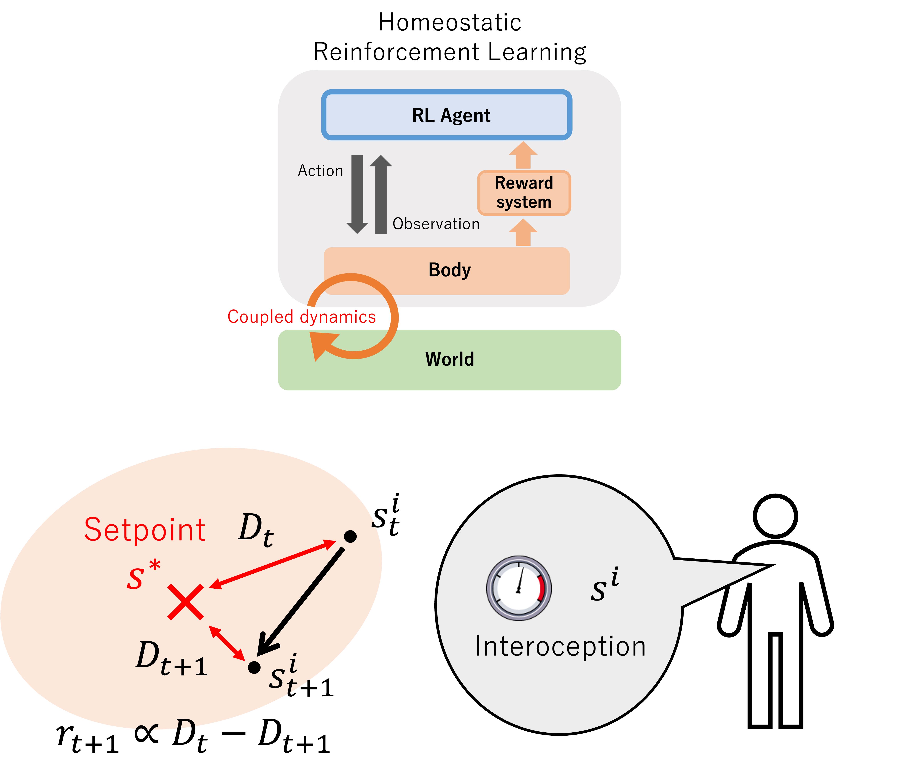
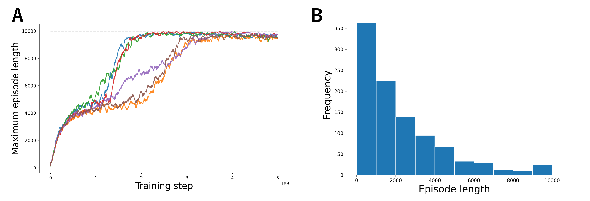

# Unexpected Capability of Homeostasis for Open-ended Learning
Project Page: https://sites.google.com/view/movingsloth/projects/unexpected-capability-of-homeostasis-for-open-ended-learning

The code is dependent on the installation of ``homeostatic_crafter`` environment: https://github.com/ugo-nama-kun/homeostatic_crafter




Homeostasis is a fundamental concept in physiology (Cannon 1939; Gross 1998), and refers to the property of organisms in which the internal environment of the body is controlled within a narrow range, or the function of such a
system that maintains that state. Keramati & Gutkin (KG) proposed homeostatic RL in computational neuroscience as a theoretical framework that uses homeostasis as a motivational principle and constructs a system that maintains
homeostasis for survival through the autonomous learning of RL agents (Keramati and Gutkin 2011, 2014).
Homeostatic RL can be treated as a subfield of RL that is based on the premise that living organisms have bodies.
In particular, by having a body, the internal state of the body and the state of the external environment (world) are dynamically coupled, and the rich dynamics inside the body, which
are usually ignored in typical RL settings, are used to define rewards (Top).

The reward definition of homeostatic RL is illustrated at bottom. Inspired by Sherrington’s classification (Sherrington 1906), we call the values that monitor the internal  state of the agent’s body interoception and express them
with s^i. Also, the target value (setpoint) for survival is assumed to exist for interoception, and this is represented by s^∗ . The error between interoception and target value is called drive (Keramati and Gutkin 2011),



By using deep homeostatic RL, it is possible to construct agents that can survive for 10,000 steps. When observing the behavior of the optimized agents, various behaviors can be seen. Some of these include behaviors that are not intuitive with respect to homeostasis.


## Setup instructions
#### Anaconda/miniconda
```commandline
conda create -n openhrl python=3.8
conda activate openhrl
```
#### Packages used
```text
pandas 2.0.3
matplotlib 3.7.3
gymnasium 0.29.1
sample_factory 2.1.1
imageio 2.35.0
imageio-ffmpeg 0.5.1
```

#### Install homeostatic_crafter env
```commandline
echo git clone or download homeostatic_crafter package 
cd {path to homeostatic_crafter}
pip install . 
```
## Usages
### Watching behaviors of pretrained agent
```commandline
bash run_hcrafter_test_enjoy.bash
```

### Run individual training
```commandline
bash run_hcrafter_train.bash
```

### Recording progress data for plotting internal states
```commandline
bash run_hcrafter_test_record.bash
```

### Reproducing Plots
```commandline
echo Plot Figure 4A
python plot_learning_curve.py

echo Plot Figure 4B
python plot_len_histogram.py

echo Plot Figure 6
python plot_progress.py 

echo Plot Figure D.3
python plot_achievement.py 
```

## Citation
```text
@misc{Source,
author = {[Anonymous Authors]},
title = {An Open Source Implementation of Unexpected Capability of Homeostasis for Open-ended Learning},
year = {2025},
publisher = {GitHub},
note = {GitHub repository},
howpublished = {\url{TBA}}
}
```